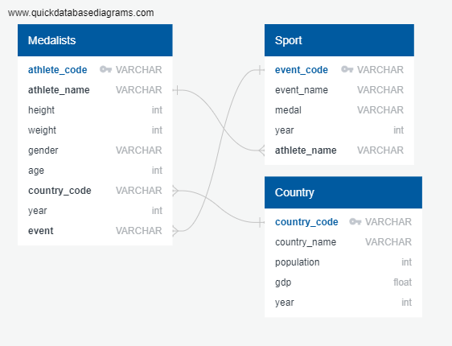
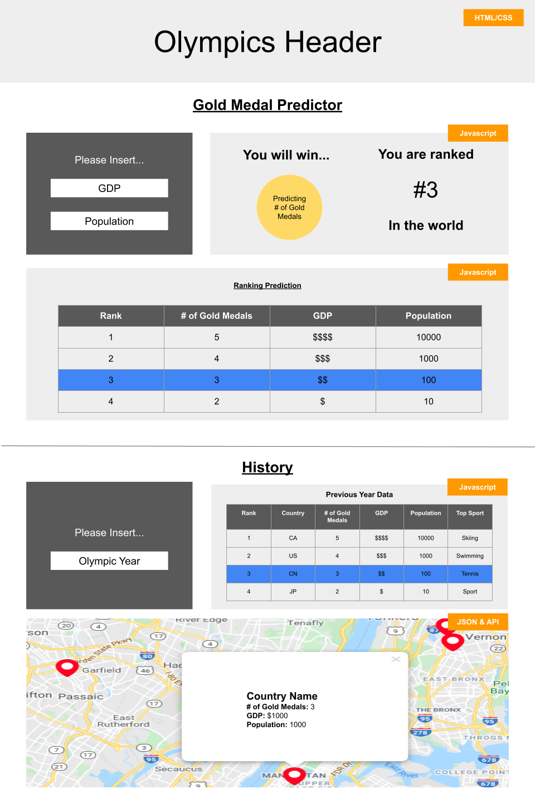

# Final-Project

**Group Name:** Olympiads

**Topic:** Olympic Medal Predictor 

**Presentation:** <a href="https://docs.google.com/presentation/d/11bAJcIVT26343fWd_sayFOkF_LyOCVCvcwEMoAe4qWE/edit#slide=id.g93969108f1_2_103">Here is the draft of our final presentation.</a>

**Dashboard:** <a href="https://alysiawon.github.io/Final-Project/Dashboard/index.html">Here is the draft of our dashboard.</a>

## 1. Overview of Project 

**Purpose Of The Project:** The purpose of this project is to comparing country statistics such as population and GDP to see if this can impact the likelihood that a country will win more gold medals. 

**Questions To Answer With The Data Source:** Based on the dataset, does population and GDP make a country more likely to win medals in Olympics?

## 2. Overview of Data

### Description of Data Source
The two outputs we would like to have is:
1. Gold Medalist Data with Country Data 
2. 2020 Olympic Data

This will be completed by utilizing <a href="Resources">datasets located in the Resources folder</a>:
- <a href="Resources/120 Years Of Olympic Data">1896 to 2016 Olympic Data</a>
- <a href="Resources/2021 Olympics">2020 Olympic Data</a>.
- <a href="Resources/World Population">World Population</a>
- <a href="Resources/World GDP">World GDP</a>
- <a href="Resources/World Coordinates">World Coordinates</a>

## 3. Data Cleaning

### Entity Relationship Diagram (ERD)
After analyzing our data, our team created an <a href="Database/ERD.png">ERD Database Draft</a>. In this draft, it will showcase how our current datasets link together.

### Cleaned Data Source
Our team cleaned and merged the data utilizing Pandas and SQL to produce <a href="Data">new datasets located in the Data folder</a>:
1. **Table 1:** Olympic History Data showcasing country name, country code, GDP, population and gold medals won
 <a href="Data/country.ipynb">Cleaned Country Information</a>
 <a href="Data/country.csv">Country Information CSV File</a>

2. **Table 2:** 2020 Olympic Data showcasing only 2020 Olympic Data
 <a href="Data/cleaned_data.ipynb">Cleaned 2020 Olympic Information</a>
 <a href="Data/Athlete+GDP&Population.csv">2020 Olympic Information CSV File</a>

3. **Table 3:** Olympic History and Mapping information showcasing country name, country code, GDP, population, latitude, longitude and gold medals won
 <a href="Data/medals.ipynb">Cleaned Olympic History & Country Information</a>
 <a href="Data/medals.csv">Olympic History & Country Information CSV File</a>

## 4. Database

## 5. Dashboard

In our dashboard, we will be highlighting two key items:
1. Olympic Gold Medal Predictor
2. Olympic History

Here is our <a href="https://docs.google.com/presentation/d/1xsYqW0NIX3Om_aYEWKTWvCO6CjRhGKa_lj4cfL7tMfA/edit?usp=sharing">Dashboard Storyboard</a> and a sample image on the right.

### Olympic Gold Medal Predictor

The purpose of this section is to allow the user to input any GDP and/or population, and our machine learning system will populate:
- How many medals will you win?
- What would your rank be based on the 2020 Olympics?
- A table to show where you would be ranked

### Olympic History

The purpose of this section is to let the user select a previous Olympic year and our system will populate:
- A table to show where you would be ranked
- A bar graph to visualize the table
- A map to showcase the country with the most medals

### Process of Creating The Dashboard

The dashboard will include utilizing Javascript, HTML, CSS, Leaflet and Plotly. 

**1. Scrape the Data**

**2. Creating Database**

Javascript and HTML was used to create a <a href="Dashboard/static/logic.js">Logic Javascript File</a> and modify the <a href="Dashboard/index.html">HTML Index File</a>. 

**3. Web Application**

<a href="Dashboard/index.html">HTML</a> and <a href="Dashboard/static/styles.css">CSS</a> was used to update our web application to make it mobile-responsive and to ensure it was easy to read and user-friendly.

## 6. Machine Learning 

Forecasting the number of Olympic medals for each country is important to different stakeholders. Using the data sources listed above we aim to find out if factors like GDP and population impact the likelihood of a country winning more gold medals in Olympic games.

### Problem Analysis
The purpose of this study is to discover the best machine learning model to predict the number of gold medals a country will win based on their GDP and population information.

Our team used supervised machine learning, more specifically a random forest algorithm which takes into account more complex non-linear interactions. Our dependent variable is the number of gold medals and the key independent variables are GDP and population.

Using the following data sets 120 years of Olympics, worldwide GDP history and population total for each country we will build a classifier that will help Olympic stakeholders  classify whether a country will win more Olympic medals compared to the past years given the population size and GDP of a country.

### Forecasting Process
- Sklearn, pandas and matplotlib libraries were used for model constructing. GDP and population were assigned as independent variables and the number of gold medals was assigned as dependent variable of the model. 

- Data was scaled to increase the speed of the program by scaling down both the X_train and X_test data.

- Then we used the fit() and predict() functions to run the regression and predict the values. 

- The next step was visualizing the relationship between dependent variable and independent variables in the regression. 

### Results
- The linear relationship was found after running the regression model. Both coefficients and intercept were discovered by analyzing the historical data, and accuracy rate was calculated by spliting data into training and testing set. The model achieved 68.34% accuracy. 

## 7. Github

**Communication Protocols:** Our team's main form of communication will be through Slack, as well as our weekly classes.

### Individual Branches
- Alysia Won's Branch Name: alysia-won
- Bala Banda's Branch Name: BalaBanda
- Frank Sun's Branch Name: frank-sun
- Steve Macpherson's Branch Name: smacpherson

### Github Layout
In our Github repository, we have created the following folders:
- <a href="Analysis">Analysis</a>: This consists of images and documnetation of our process. 
- <a href="Dashboard">Dashboard</a>: This folder is used to create the dashboard utilizing techniques such as Javascript, CSS, and HTML.
- <a href="Data">Data</a>: This folder consists of our cleaned data that was completed using Pandas and SQL, as well as our ERD diagram.
- <a href="Resources">Resources</a>: This folder consists of the original datasets.
- <a href="Machine Learning">Machine Learning</a>: This folder consists of our Machine Learning diagram and framework.
