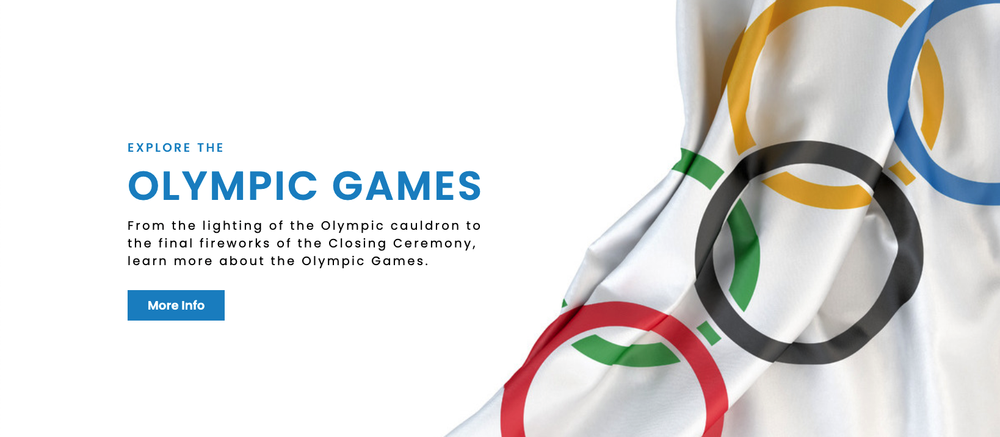

# Final-Project

**Group Name:** Olympiads

**Topic:** Olympic Medal Predictor 

**Presentation:** <a href="https://docs.google.com/presentation/d/11bAJcIVT26343fWd_sayFOkF_LyOCVCvcwEMoAe4qWE/edit#slide=id.g93969108f1_2_103">Here is our final presentation.</a>

**Dashboard:** <a href="https://alysiawon.github.io/Final-Project/Dashboard/index.html">Here is our dashboard.</a>

## 1. Overview of Project 

### Purpose Of The Project:

The purpose of this project is to create an overview of the Olympic history and use that data to predict the number of gold medals a country could win. The project will consist of two elements:

**1. Olympic History Dashboard:** The Olympic History Dashboard will provide a summary of each Olympic year and the number of gold medals they won. It will also showcase their GDP and population for that specific year. 

**2. Gold Medal Predictor:** The Gold Medal Predicator will predict the exact number of medals you will win depending on the estimated GDP and population of the country. 

### Questions To Answer

Based on the dataset, does population and GDP make a country more likely to win medals in Olympics?

## 2. Overview of Data & Database

In this project, we focus on using historic Olympic data and country data such as GDP and population to create the historic dashboard and the gold medal predictor. 

### Description of Datasets

By utilizing datasets from Kaggle, World Bank and Google, we were able to find our data. The downloaded datasets are located in the <a href="Database/1. Datasets">Data folder</a>. Listed below is the links to the original datasets:
- <a href="https://www.kaggle.com/mysarahmadbhat/120-years-of-olympic-history">1896 to 2016 Olympic Data</a>
- <a href="https://www.kaggle.com/arjunprasadsarkhel/2021-olympics-in-tokyo">2020 Olympic Data</a>.
- <a href="https://www.kaggle.com/themlphdstudent/countries-population-from-1955-to-2020">World Population</a>
- <a href="https://www.kaggle.com/jonscheaffer/worldwide-gdp-history-19602016">World GDP</a>
- <a href="https://developers.google.com/public-data/docs/canonical/countries_csv">World Coordinates</a>

### Entity Relationship Diagram (ERD)

After searching for the data, our team created an <a href="Database/2. ERD">ERD Database</a>. In this ERD, it will showcase how our datasets link together to create our cleaned datasets. The left showcases the original datasets and the left showcases our final datasets we will use to build our model and how it links together. 

As a result, the final two outputs that are created are:

**1. Medals Data:** A list of gold medalist countries and their country data (GDP, population, coordinates)

**2. Tokyo Data:** A list of the 2020 gold medalist countries

### Cleaned Data Source

After planning how our data will link together, our team worked on cleaning our datasets to create the final dataframe needed for this project. The data cleaning process and final CSV files are located in the<a href="Database/3. Cleaned Data">cleaned data folder</a>.

Our team utilized <a href="Database/3. Cleaned Data/medals.iypnb">Pandas</a> to clean the data, merge dataframes, reformat the columns and the data. 

The final CSV files are:
1. <a href="Database/3. Cleaned Data/medals.csv">Table 1: Medals Dataframe</a>
2. <a href="Database/3. Cleaned Data/tokyo.csv">Table 2: Tokyo Dataframe</a>

### Database

Our team created a local database application to store our data utilizing AWS, pgAdmin, SQL and Python. 

The process we used to create a local database included:

1. Creating an AWS RDS database and linked it to pgAdmin. 
2. After linking it to pgAdmin, we were able to use SQL to link our clean data onto our local database.

3. Once pgAdmin was set up, we create an <a href="Dashbord/app.py">application</a> utilizing Flask which we later linked it to our dashboard. 

## 3. Machine Learning 

Forecasting the number of Olympic medals for each country is important to different stakeholders. Using the data sources listed above we aim to find out if factors like GDP and population impact the likelihood of a country winning more gold medals in Olympic games.

### Problem Analysis
The purpose of this study is to discover the best machine learning model to predict the number of gold medals a country will win based on their GDP and population information.

Our team used supervised machine learning, more specifically a random forest algorithm which takes into account more complex non-linear interactions. Our dependent variable is the number of gold medals and the key independent variables are GDP and population.

Using the following data sets 120 years of Olympics, worldwide GDP history and population total for each country we will build a classifier that will help Olympic stakeholders  classify whether a country will win more Olympic medals compared to the past years given the population size and GDP of a country.

### Forecasting Process
- Sklearn, pandas and matplotlib libraries were used for model constructing. GDP and population were assigned as independent variables and the number of gold medals was assigned as dependent variable of the model. 

- Data was scaled to increase the speed of the program by scaling down both the X_train and X_test data.

- Then we used the fit() and predict() functions to run the regression and predict the values. 

- The next step was visualizing the relationship between dependent variable and independent variables in the regression. 

### Result of the machine learning analysis
- The linear relationship was found after running the regression model. Both coefficients and intercept were discovered by analyzing the historical data, and accuracy rate was calculated by spliting data into training and testing set. The model achieved 68.34% accuracy. 

## 4. Dashboard

In our dashboard, we will be highlighting two key items:
1. Olympic Gold Medal Predictor
2. Olympic History

### Olympic Gold Medal Predictor

The purpose of this section is to allow the user to input any GDP and/or population, and our machine learning system will populate:
- How many medals will you win?
- What would your rank be based on the 2020 Olympics?
- A table to show where you would be ranked

### Olympic History

The purpose of this section is to let the user select a previous Olympic year and our system will populate:
- A table to show where you would be ranked
- A bar graph to visualize the table
- A map to showcase the country with the most medals

### Process of Creating The Dashboard

The dashboard will include utilizing Python, Javascript, HTML, CSS, Leaflet and Plotly. 

**1. Create the Framework**

Once our team determined our plan, we created a <a href="https://docs.google.com/presentation/d/1xsYqW0NIX3Om_aYEWKTWvCO6CjRhGKa_lj4cfL7tMfA/edit?usp=sharing">Dashboard Storyboard Framework</a>. A sample image on the right.

**2. Creating The Dashboard**

Javascript and HTML was used to create a <a href="Dashboard/static/logic.js">Logic Javascript File</a> and modify the <a href="Dashboard/index.html">HTML Index File</a>. 

**3. Linking the Database and the Dashboard**

We linked the <a href="Dashbord/app.py">database application</a> to the dashboard and was able to run our system utilizing our local server. 

**4. Web Application**

Lastly we used <a href="Dashboard/index.html">HTML</a> and <a href="Dashboard/static/styles.css">CSS</a> was used to update our web application to make it mobile-responsive and to ensure it was easy to read and user-friendly.

## 5. Github

**Communication Protocols:** Our team's main form of communication will be through Slack, as well as our weekly classes.

### Individual Branches
- Alysia Won's Branch Name: alysia-won
- Frank Sun's Branch Name: frank-sun

### Github Layout
In our Github repository, we have created the following folders:
- <a href="Dashboard">Dashboard</a>: This folder consists of the dashboard utilizing techniques such as Javascript, CSS, and HTML, as well as our database utilizing Pandas and Flask.
- <a href="Database">Database</a>: This folder consists of the original datasets, the ERD draft, our cleaned dataset that was completed using Pandas, and our SQL queriers to set up the database.
- <a href="Machine Learning">Machine Learning</a>: This folder consists of our Machine Learning diagram and framework.
